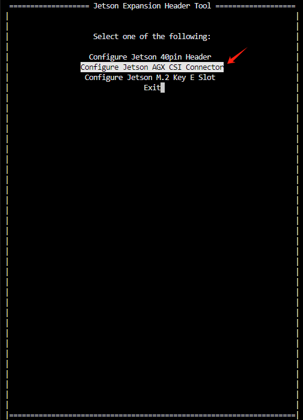
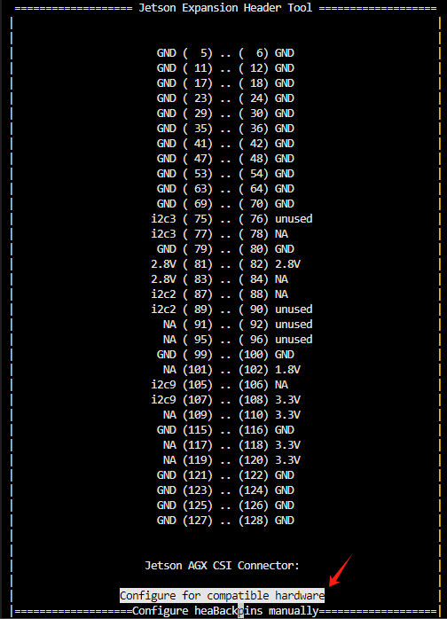
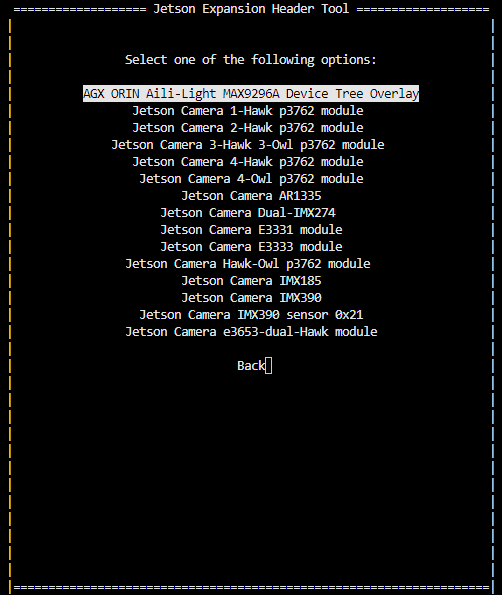
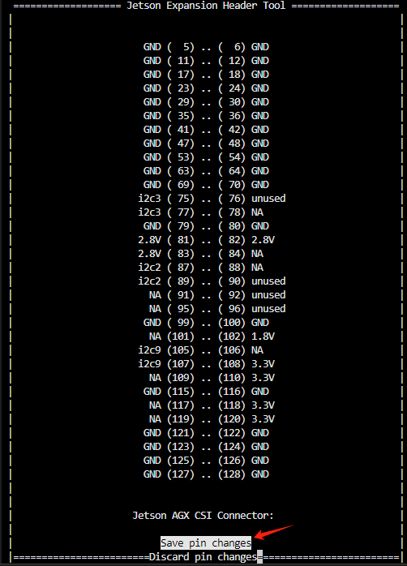
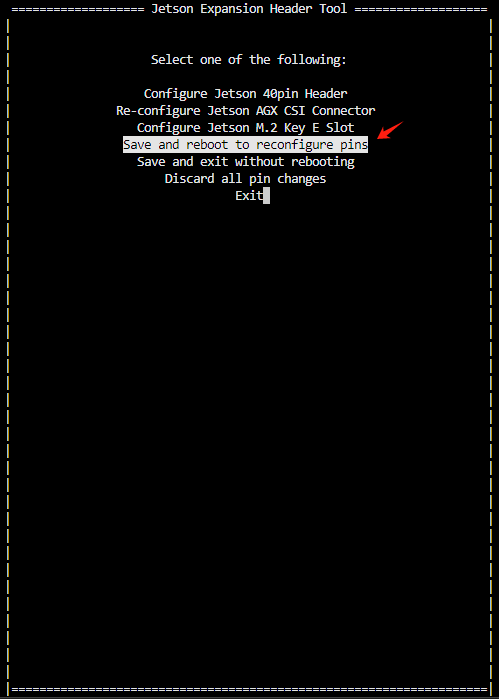

# 艾利光相机通用驱动使用说明
====================================
艾利光针对NVIDIA Jetson AGX Orin平台的通用摄像头驱动框架 

## 1. 文件说明

``` sh
├── app
│   ├── config
│   │   ├── alg_isx_031_1_ch_master.json        # alg031 master单通道点亮配置
│   │   ├── alg_isx_031_2_ch_master.json        # alg031 master双通道点亮配置
│   │   └── table
│   │       ├── ALG_MADE_0003101_9296_96717_6G_ISX031_YUV422_1920_1536_MIPI_4LANES_30FPS_MFP9_Master_AFL2_CH_V2_0.txt
│   │       └── ALG_MADE_0103101_9296_96717_6G_ISX031_YUV422_1920_1536_MIPI_4LANES_30FPS_MFP9_Master_AFL1_CH_V2_0.txt
│   └── config_sensor_test              # 相机配置软件
├── boot
│   └── tegra234-eac5000-camera-aili-light-max9296-overlay.dtbo # 插件设备树
├── doc
│   └── readme.md                       # 使用说明
└── driver
│   └── alg-max9296.ko                  # 驱动
└── 8ch_031_master_test.sh              # 8通道031测试脚本
```


## 2.刷机和配置pin mux

  参考官方指导，刷系统到jeston linux到系统r36.4.3

​	https://docs.nvidia.com/jetson/archives/r36.4.3/DeveloperGuide/IN/QuickStart.html#preparing-a-jetson-developer-kit-for-use

其中，需要将我们提供的pinmux和gpio设备树替换原来的bsp包中的对应文件

```sh
└── bootloader
    ├── BCT
    │   └── tegra234-mb1-bct-pinmux-p3701-0000-a04.dtsi
    └── tegra234-mb1-bct-gpio-p3701-0000-a04.dtsi
```


## 3. 设备树加载

设备树只加载1次就好,后续重启主机不需要加载 

设备树加载可以参考官方指导：

[Configuring the CSI Connector](https://docs.nvidia.com/jetson/archives/r36.4.3/DeveloperGuide/HR/ConfiguringTheJetsonExpansionHeaders.html#configuring-the-csi-connector)


1. 运行指令`sudo cp boot/tegra234-eac5000-camera-aili-light-max9296-overlay.dtbo /boot/`，首先把设备树插件放入到`/boot`文件夹下，

2. 运行指令：`sudo /opt/nvidia/jetson-io/jetson-io.py` 打开软件jetson-io

3. 选择`Configure Jetson AGX CSI Connector`



4. 选择`Configure for compatible hardware`



5. 选择`AGX ORIN Aili-Light MAX9296A Device Tree Overlay`



6. 选择`Save pin changes`



7. 选择`Save and reboot to reconfigure pins`



8. 等待设备重启，重启之后，可以通过如下指令查看设备树加载是否成功,成功的话，会有如下输出

``` sh
$ ls /proc/device-tree/bus@0/i2c@3180000/tca9546@70/i2c@0/

gmslcomm_a@4 gmslcomm_b@5 ...
```


## 4. 相机驱动加载

驱动在系统开机之后，需要手动加载`alg-max9296.ko`

`sudo insmod driver/alg-max9296.ko`

注意：加载驱动指令执行后，需要等待3-5秒，等待所有video设备全部加载成功！

可以使用如下指令查看是否成功，成功会有如下输出

``` sh
$ ls /dev/vid*

/dev/video0  /dev/video1  /dev/video2  /dev/video3  /dev/video4  /dev/video5  /dev/video6  /dev/video7
```


## 5. 触发器驱动加载

驱动在系统开机之后，需要手动加载`trigger.ko`

`sudo insmod driver/trigger.ko`

可以使用如下指令查看是否成功，成功会有如下输出

``` sh
$ ls /dev/aili_trigger*
/dev/aili_trigger0
```


## 6. 相机配置

接下来要使用APP `config_sensor_test` 去加载配置

这里需要注意一下，相邻2个通道使用同一个的解串器，暂时驱动只支持在同一个接触器上使用相同的相机！！

比如我想再0、1通道使用2个031相机，可以给0通道或者1通道下发双通道031配置`alg_isx_031_2_ch_master.json`。

如果我只在0、1通道接1个031相机，可以给0通道或者1通道下发单通道031配置`alg_isx_031_1_ch_master.json`，需要注意的是,这里提供的单通道配置，是从1通道出图的，所以预览的话，使用video1去预览图像！！！


比如我想配置8路031相机，可以如下配置
``` sh
$ cd app

$ ./config_sensor_test --set-ch-param --type MAX9296A --ch 0  --param ./config/alg_isx_031_2_ch_master.json

sleep 3s

$ ./config_sensor_test --set-ch-param --type MAX9296A --ch 2  --param ./config/alg_isx_031_2_ch_master.json

sleep 3s

$ ./config_sensor_test --set-ch-param --type MAX9296A --ch 4  --param ./config/alg_isx_031_2_ch_master.json

sleep 3s

$ ./config_sensor_test --set-ch-param --type MAX9296A --ch 6  --param ./config/alg_isx_031_2_ch_master.json

```

比如我想配置8路08b相机，可以如下配置
``` sh
$ cd app

$ ./config_sensor_test --set-ch-param --type MAX9296A --ch 0  --param ./config/alg_ox08b_2_ch_96717_master.json

sleep 3s

$ ./config_sensor_test --set-ch-param --type MAX9296A --ch 2  --param ./config/alg_ox08b_2_ch_96717_master.json

sleep 3s

$ ./config_sensor_test --set-ch-param --type MAX9296A --ch 4  --param ./config/alg_ox08b_2_ch_96717_master.json

sleep 3s

$ ./config_sensor_test --set-ch-param --type MAX9296A --ch 6  --param ./config/alg_ox08b_2_ch_96717_master.json

```


## 7. 触发配置

​	内触发模式，30hz，需要执以下2条指令

```sh
sudo ./aili_trigger_test --set_param 2
sudo ./aili_trigger_test --status on
```

如果使用外触发，需要执行以下2条指令

```sh
sudo ./aili_trigger_test --set_param 0
sudo ./aili_trigger_test --status on
```


## 8. 提高orin频率

如果使用2路08b，orin需要提高

``` sh

# 提高orin vi、isp、nvcsi 的频率
echo 1 | sudo tee /sys/kernel/debug/bpmp/debug/clk/vi/mrq_rate_locked
echo 1 | sudo tee /sys/kernel/debug/bpmp/debug/clk/isp/mrq_rate_locked
echo 1 | sudo tee /sys/kernel/debug/bpmp/debug/clk/nvcsi/mrq_rate_locked
echo 1 | sudo tee /sys/kernel/debug/bpmp/debug/clk/emc/mrq_rate_locked
sudo cat /sys/kernel/debug/bpmp/debug/clk/vi/max_rate    | sudo tee /sys/kernel/debug/bpmp/debug/clk/vi/rate
sudo cat /sys/kernel/debug/bpmp/debug/clk/isp/max_rate   | sudo tee /sys/kernel/debug/bpmp/debug/clk/isp/rate
sudo cat /sys/kernel/debug/bpmp/debug/clk/nvcsi/max_rate | sudo tee /sys/kernel/debug/bpmp/debug/clk/nvcsi/rate
sudo cat /sys/kernel/debug/bpmp/debug/clk/emc/max_rate   | sudo tee /sys/kernel/debug/bpmp/debug/clk/emc/rate

```


## 9. 预览

可以使用gstreamer去预览，比如显示8通道031图像可以使用如下指令

``` sh
$ gst-launch-1.0 v4l2src device=/dev/video0 ! 'video/x-raw,format=UYVY,width=1920,height=1536' ! videoconvert ! fpsdisplaysink video-sink=xvimagesink sync=false &
$ gst-launch-1.0 v4l2src device=/dev/video1 ! 'video/x-raw,format=UYVY,width=1920,height=1536' ! videoconvert ! fpsdisplaysink video-sink=xvimagesink sync=false &
$ gst-launch-1.0 v4l2src device=/dev/video2 ! 'video/x-raw,format=UYVY,width=1920,height=1536' ! videoconvert ! fpsdisplaysink video-sink=xvimagesink sync=false &
$ gst-launch-1.0 v4l2src device=/dev/video3 ! 'video/x-raw,format=UYVY,width=1920,height=1536' ! videoconvert ! fpsdisplaysink video-sink=xvimagesink sync=false &
$ gst-launch-1.0 v4l2src device=/dev/video4 ! 'video/x-raw,format=UYVY,width=1920,height=1536' ! videoconvert ! fpsdisplaysink video-sink=xvimagesink sync=false &
$ gst-launch-1.0 v4l2src device=/dev/video5 ! 'video/x-raw,format=UYVY,width=1920,height=1536' ! videoconvert ! fpsdisplaysink video-sink=xvimagesink sync=false &
$ gst-launch-1.0 v4l2src device=/dev/video6 ! 'video/x-raw,format=UYVY,width=1920,height=1536' ! videoconvert ! fpsdisplaysink video-sink=xvimagesink sync=false &
$ gst-launch-1.0 v4l2src device=/dev/video7 ! 'video/x-raw,format=UYVY,width=1920,height=1536' ! videoconvert ! fpsdisplaysink video-sink=xvimagesink sync=false &
```

比如显示8通道08b图像可以使用如下指令

``` sh
$ gst-launch-1.0 v4l2src device=/dev/video0 ! 'video/x-raw,format=UYVY,width=3840,height=2160' ! videoconvert ! fpsdisplaysink video-sink=xvimagesink sync=false &
$ gst-launch-1.0 v4l2src device=/dev/video1 ! 'video/x-raw,format=UYVY,width=3840,height=2160' ! videoconvert ! fpsdisplaysink video-sink=xvimagesink sync=false &
$ gst-launch-1.0 v4l2src device=/dev/video2 ! 'video/x-raw,format=UYVY,width=3840,height=2160' ! videoconvert ! fpsdisplaysink video-sink=xvimagesink sync=false &
$ gst-launch-1.0 v4l2src device=/dev/video3 ! 'video/x-raw,format=UYVY,width=3840,height=2160' ! videoconvert ! fpsdisplaysink video-sink=xvimagesink sync=false &
$ gst-launch-1.0 v4l2src device=/dev/video4 ! 'video/x-raw,format=UYVY,width=3840,height=2160' ! videoconvert ! fpsdisplaysink video-sink=xvimagesink sync=false &
$ gst-launch-1.0 v4l2src device=/dev/video5 ! 'video/x-raw,format=UYVY,width=3840,height=2160' ! videoconvert ! fpsdisplaysink video-sink=xvimagesink sync=false &
$ gst-launch-1.0 v4l2src device=/dev/video6 ! 'video/x-raw,format=UYVY,width=3840,height=2160' ! videoconvert ! fpsdisplaysink video-sink=xvimagesink sync=false &
$ gst-launch-1.0 v4l2src device=/dev/video7 ! 'video/x-raw,format=UYVY,width=3840,height=2160' ! videoconvert ! fpsdisplaysink video-sink=xvimagesink sync=false &
```