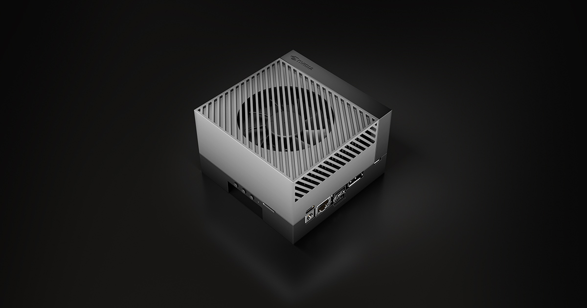
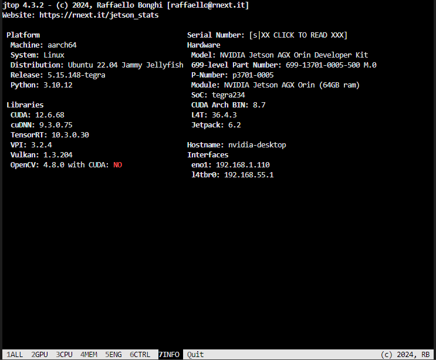

# GMSL Camera Adapter Kit Driver for NVIDIA Platform
====================================  
This repository provides ALG-Tech's GMSL camera driver framework for the NVIDIA Jetson AGX Orin platform. The driver is only compatible with ALG-Tech's GMSL camera adapter board. [中文](./README_CN.md)

For more information check the [website](https://www.alg-imaging.com)

## Important Note

This driver is compatible with `NVIDIA JETSON AGX ORIN Development Kit 64G`

Make sure the following version numbers are matched.  
1. Jetpack Version <6.2>
2. Jetson Linux Version <r36.4.3>

Verify the information by using `jtop` command on your device.

## ALG Camera Driver Framework
Please refer to [Driver](./NVIDIA_AGX_ORIN_ALG_CAM_COMM_8CH/doc/README.md) for specific descriptions.

# Support
contact : jimmy@alg-imaging.com

# Copyright
2020-2025 Shenzhen Aili-Light Co.,Ltd  