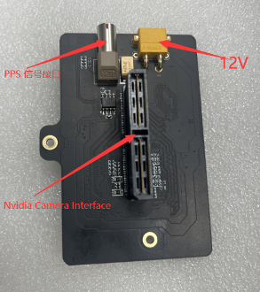
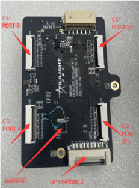
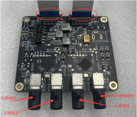
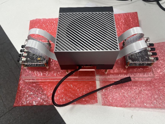
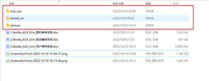

GMSL Camera Adapter Kit Driver for NVIDIA Platform
====================================  
This repository provides GMSL camera driver for the NVIDIA Jetson platform. The driver is only compatible with ALG (www.alg-imaging.com) GMSL camera module and adapter board. 
[中文](./README_CN.md)

# Important Note
1. This repository provides GMSL camera driver for Jetson Orin Development Kit.  
2. This driver is developped for ALG GMSL camera module only.  
3. This driver is compatible only with JetPack5.02.  
4. PINMUX update is required to connect ALG camera module.  

# Prerequisites
1. GMSL Camera modules(https://www.alg-imaging.com/product/alg-3m-automotive-camera-isx031-driving-front-view-adas-hd-waterproof-gmsl2/)  
2. Adapter board(https://www.alg-imaging.com/product/alg-8-channel-gmsl-adapter-board-for-jetson-orin-development-kit/)  
3. Jetson AGX Orin Developer Kit(https://www.nvidia.com/en-au/autonomous-machines/embedded-systems/jetson-orin/)  

# Hardware setup
## Get ready for hardwares  
1. NVIDIA Jetson AGX ORIN Official Development Kit  
2. 12V Power adapter  
3. ALG GMSL adapter board  
4. ALG GMSL camera module (3MP/8MP)
## Introduction to the Jetson ORIN Adapter Board
1. Main board  


2. Sub board  

## Setup instruction
1. Stackup main board on the connector at the back side of Jetson Orin .  
2. Connect main board with two sub boards by FPC cables. 
3. Connect power cable to the power port(12V) of main board.  
4. Connect GMSL cameras to the Fakra connector on sub board (maximum 4-CH per board).  
## Hardware setup as displayed in thefollowing image  



# Driver file
The driver file package includes pinmux/bsp_out. User should copy those files to the Jetson Orin system.  

## pinmux
Pinmus is used for device tree pin remapping while using the ALG camera modules. Please refer to "flashing guide" for more information.  
## bsp_out
bsp_out includes the compiled kernel driver file to be loaded on Jeston Orin system.  

# Environment setup
Follow this instruction to setup environment on Jetson Orin system.  
## Install tools
```bash
nvidia@nvidia-desktop:~$ sudo apt install v4l2loopback-utils v4l-utils vlc gstreamer1.0-tools gstreamer1.0-plugins-bad gstreamer1.0-plugins-base gstreamer1.0-plugins-good gstreamer1.0-x
```

# Load driver
## Make the bash script executable
```bash
chmod +x upgrade.sh install_ko.sh
```
## Run update script
```bash
./upgrade.sh
```
## Reboot Orin to finsh

## Load driver after reboot
```bash
./install_ko.sh
```

# Preview images
cam0:
```bash
gst-launch-1.0 v4l2src device=/dev/video0 ! 'video/x-raw,format=UYVY,width=1920,height=1536' ! videoconvert ! fpsdisplaysink video-sink=xvimagesink sync=false
```
cam1: 
```bash
gst-launch-1.0 v4l2src device=/dev/video1 ! 'video/x-raw,format=UYVY,width=1920,height=1536' ! videoconvert ! fpsdisplaysink video-sink=xvimagesink sync=false
```
...


# Note
1. The camera driver is not hot-pluggable. User must connect the camera correctly before system power on.  
2. Jetson Orin will load camera drivers automatically on boot. To verify the driver is loaded on the system please use : 
```bash
ls | grep /dev/video* 
```
