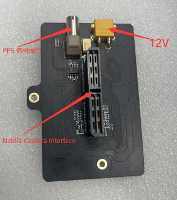
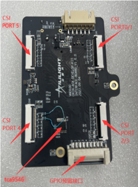
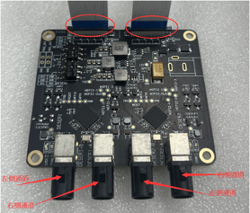
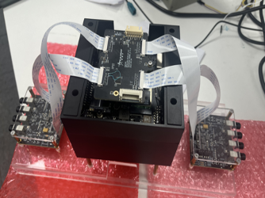
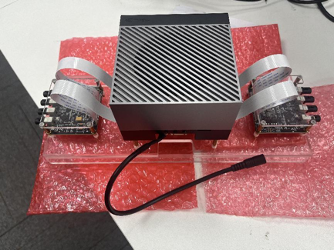
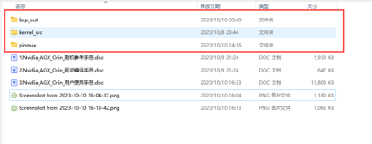
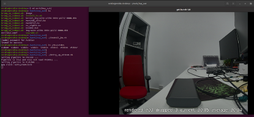

GMSL相机接入套件驱动
====================================
本仓库提供了GMSL相机接入NVIDIA Jetson平台的驱动。该驱动仅适配艾利光（www.aili-light.com）的GMSL摄像头模组和转接板。

# 重要提示
1. 本仓库提供面线Jetson Orin开发套件的GMSL相机接入驱动.  
2. 本驱动文件仅对艾利光摄像头模组有效.  
3. 本驱动仅适配Orin内核版本JetPack5.02 (内核 R35.5).  
4. 需要对PINMUX进行更新以适配艾利光模组.  

# 前置条件
1. GMSL摄像头模组(https://www.aili-light.com/alg-automotive-camera/3MP-camera-modules.html)  
2. 转接板(https://www.aili-light.com/products_46/142.html)  
3. Jetson AGX Orin Developer Kit(https://www.nvidia.com/en-au/autonomous-machines/embedded-systems/jetson-orin/)  

# 硬件设置
## 准备硬件  
1. NVIDIA Jetson AGX ORIN 官方开发套件  
2. 12V电源适配器  
3. 艾利光GMSL转接套件
4. 艾利光GMSL摄像头模组（3MP/8MP）  
## Jetson Orin转接套件说明
1. 主板  


2. 子板  

## 安装说明
1. 将主板反扣在Jetson Orin背面的连接器上。  
2. 将主板和子板通过两条FPC软排线连接。  
3. 将12V电源连接在主板上。  
4. 将相机接入到子板的Fakra接口（每个子板最多4通道）。  
## 整体硬件设置图示 



# 驱动文件
驱动文件包含bsp_out. 用户需要将这些文件拷贝到 Jetson Orin 系统.  

## bsp_out
Bsp_out内容主要为编译完成的驱动、内核等文件，可以直接在NVIDIA_AGX_ORIN。  

# 环境配置
参考以下指示对Jetson Orin系统进行配置.  
## 安装相关工具
```bash
nvidia@nvidia-desktop:~$ sudo apt install v4l2loopback-utils v4l-utils vlc gstreamer1.0-tools gstreamer1.0-plugins-bad gstreamer1.0-plugins-base gstreamer1.0-plugins-good gstreamer1.0-x
```

# 加载驱动 & 预览图像
[ALG08B-4CH](./NVIDIA_AGX_ORIN_ALG08B_4CH/bsp_out/README_CN.md)
[ALG031-8CH](./NVIDIA_AGX_ORIN_ALG031_8CH/bsp_out/README_CN.md)
[ALG019-8CH](./NVIDIA_AGX_ORIN_ALG019_8CH/bsp_out/README_CN.md)
[ALG08B-3CH+ALG031-2CH](./NVIDIA_AGX_ORIN_ALG08B_3CH_ALG031_2CH/bsp_out/README_CN.md)


# 备注
1. 相机驱动不支持热插拔，用户需要将相机提前介入到系统.  
2. Jetson Orin系统会在驱动的时候自动加载驱动，请通过以下方式确认驱动是否加载成功 : 
```bash
ls | grep /dev/video* 
```
