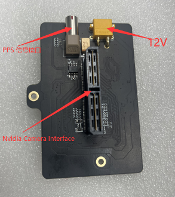
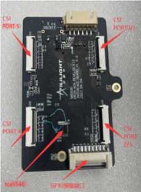
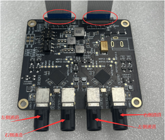
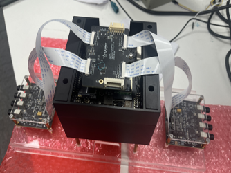
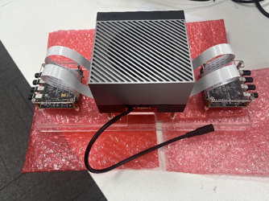

# 艾利光相机通用驱动使用说明
====================================  
本目录提供艾利光专为NVIDIA Jetson AGX Orin平台开发的摄像头通用驱动框架。此驱动框架仅适用于艾利光科技的GMSL转接套件。

详细信息请查阅网站：[website](https://www.aili-light.com)

## 重要信息
此驱动只适配于NVIDIA官方的主机`NVIDIA JETSON AGX ORIN Development Kit 64G`的硬件。

请确认系统版本号：
适配版本jetpak版本： <6.2>
对应的jeston Linux 版本：<r36.4.3>
上述软件版本可以使用指令`jtop`中的`7INFO`页面查看：

# 前置条件
1. GMSL摄像头模组(https://www.aili-light.com/alg-automotive-camera/3MP-camera-modules.html)  

2. 转接板(https://www.aili-light.com/products_46/142.html)  

# 硬件设置
## 准备硬件  
1. NVIDIA Jetson AGX ORIN 官方开发套件  
2. 12V电源适配器  
3. 艾利光GMSL转接套件
4. 艾利光GMSL摄像头模组（3MP/8MP） 

## Jetson Orin转接套件说明
1. 主板  

2. 子板  

## 安装说明
1. 将主板反扣在Jetson Orin背面的连接器上。  
2. 将主板和子板通过两条FPC软排线连接。  
3. 将12V电源连接在主板上。  
4. 将相机接入到子板的Fakra接口（每个子板最多4通道）。  

## 整体硬件设置图示 

## 驱动框架
驱动框架详细信息，请查阅页面[Driver](./NVIDIA_AGX_ORIN_ALG_CAM_COMM_8CH/doc/README_CN.md).

# 技术支持
请联系 : jimmy@ailiteam.com

# 版权
2020-2025 深圳市艾利光科技有限公司  